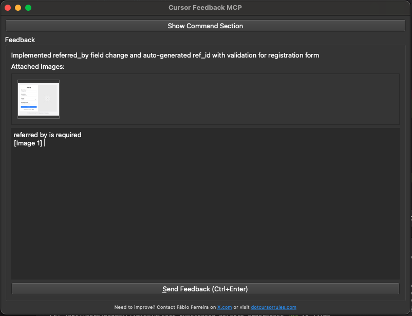

# Cursor Feedback MCP

- Original Project: [noopstudios/interactive-feedback-mcp](https://github.com/noopstudios/interactive-feedback-mcp) ⭐

## Features

- [x] Text Feedback
- [x] Image Support



*The interactive feedback UI allows you to paste images directly, making it easy to provide visual feedback and context. This is the main feature that makes this MCP tool unique.*

## Usage

1. uv sync
2. uv run server.py
3. Configure in Cursor:

```json
{
  "mcpServers": {
    "interactive-feedback-mcp": {
      "command": "uv",
      "args": [
        "--directory",
        "/Users/oplacrm/workspace/mcp/cursor-feedback",
        "run",
        "server.py"
      ],
      "timeout": 600,
      "autoApprove": [
        "interactive_feedback"
      ]
    }
  }
}
```

4. Cursor rules

See [.cursorrules](.cursorrules) file for the complete interactive feedback rule configuration. This rule ensures that:
- Interactive feedback is called before asking clarifying questions
- Interactive feedback is called before completing requests
- Proper parameters are provided for effective feedback collection
